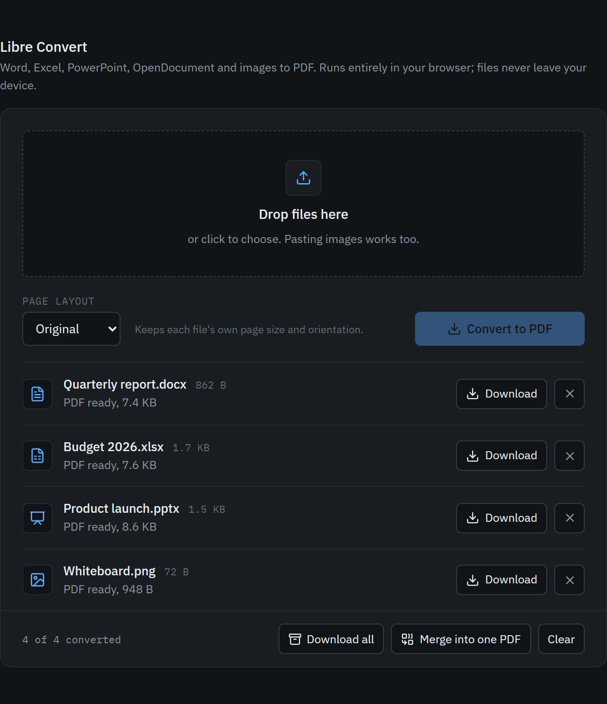

# Libre Convert

Convert Word, Excel, PowerPoint, OpenDocument and image files to PDF entirely in your browser. Files never leave your device: conversion runs locally in [LibreOffice compiled to WebAssembly](https://zetaoffice.net/).

**[Open Libre Convert](https://rhgx.github.io/libre-convert/)**

## Features

- Drop, pick or paste any number of files and convert them in one go.
- Page layout: keep each file's own setup, or force portrait or landscape. Documents and spreadsheets re-paginate natively, so links and selectable text survive. Slides and images are fitted onto A4.
- Download files one by one, all at once as a ZIP, or merged into a single PDF.
- Failed files can be retried. The engine starts loading as soon as you add a document.
- Works offline after the first conversion, and can be installed as an app.

## Supported formats

| Type | Extensions |
| --- | --- |
| Documents | DOC, DOCX, DOCM, DOTX, ODT, OTT, RTF, TXT |
| Spreadsheets | XLS, XLSX, XLSM, ODS, OTS, CSV |
| Presentations | PPT, PPTX, PPS, PPSX, ODP, OTP |
| Drawings | ODG |
| Images | PNG, JPG, JPEG, GIF, BMP, WEBP, AVIF |

## Browser support

Tested in Chromium; other current browsers should work. Private browsing modes that block service workers can still convert images, but not documents.

## Documentation

- [How it works](.docs/how-it-works.md): the conversion pipeline, cross-origin isolation, caching and project layout.
- [Development](.docs/development.md): running, testing and deploying.

## License

[MIT](LICENSE). The LibreOffice runtime is loaded from ZetaOffice at runtime and is covered by its own license.
